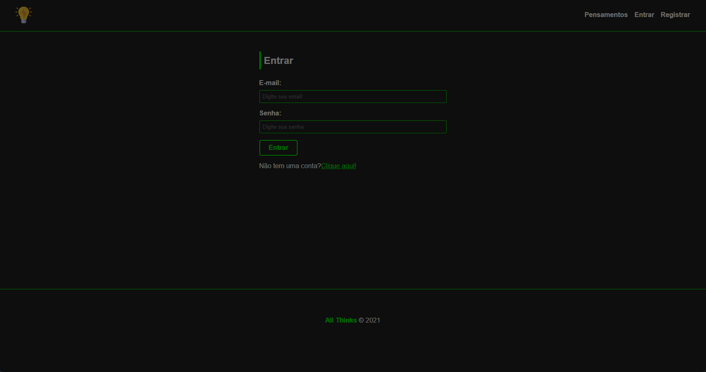
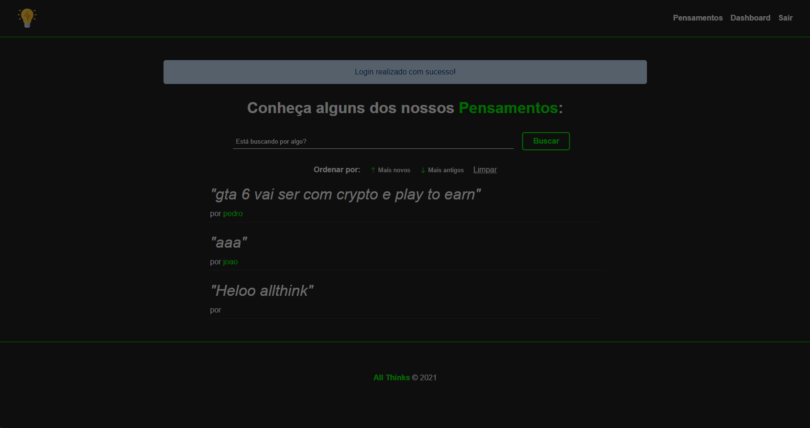
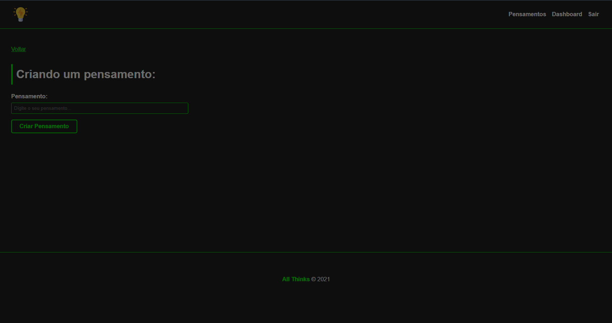
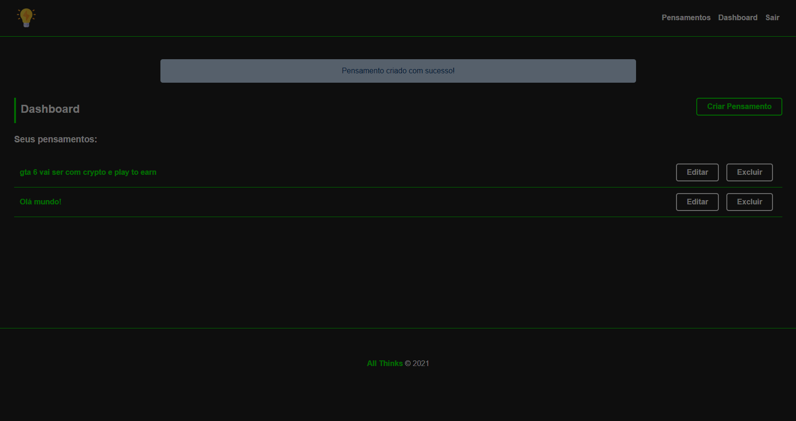
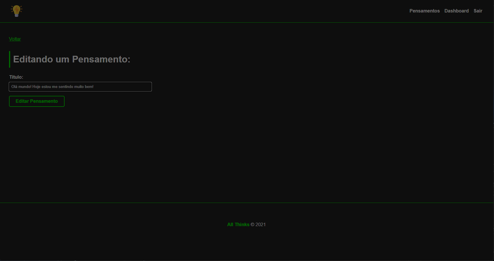
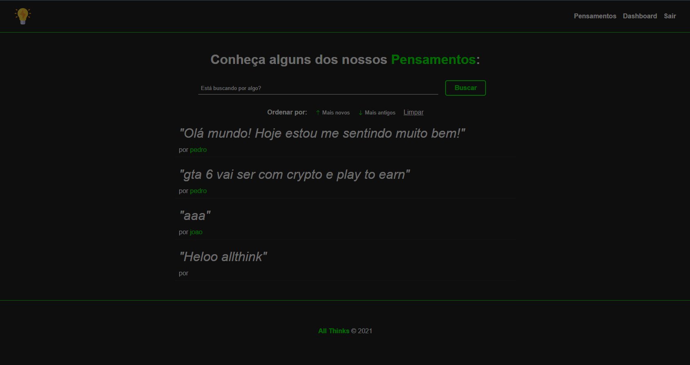
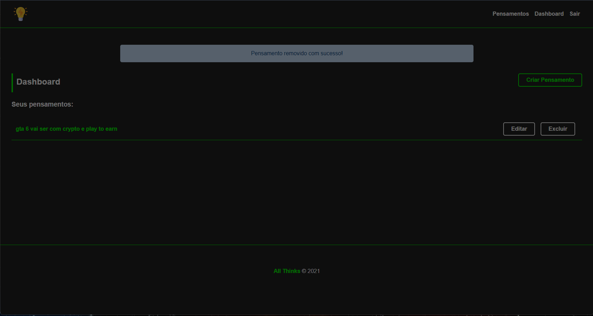

## All Think ##

 

Here are the technologies used in this project.

- NodeJS version 16.15.0
- MySQL version 2.3.3
- Sequelize version 6.21.0
- Nodemon version 2.0.16
- Express version 4.18.1
- Express-handlebars version 6.0.6
- Bootstrap library
- bcryptjs 2.4.3
- connect-flash 0.1.1
 
 

## Services Used]

- Github
 
 

## Getting started
Start the project and install as dependencies. 
Create Database with MySQL. 
Create the project structure according to the MVC pattern.
 
 

## How to use

 1 - When accessing the home page, create a user.
 

2 - Login successfully

3 - Creating a thought

4 - Dashboard with all thoughts

5 - Editing Thought

6 - Dashboard edited thoughts

7 - Removing thought

 
 

## Features

- Create
- Edit
- Target
- Remove
- Authentication
- show to all
- filter

 

## Resume:
* NodeJS: Used in the project to communicate with the server. 
* MySQL: Relational database where task files are saved. 
* Sequelize: Used to maintain and guarantee the integrity of the data being moved in the database, going beyond the basic layers of MVC. 
* Nodemon: Used to automatically restart the server and optimize time. 
* Express: Express offers solutions to manage requests for different HTTP verbs in different URLs. Integrate "view engines" to insert data into templates. 
* Express-handlebars: Used to provide a visual user interface with HTML and CSS. 
* bcryptjs: Used to encrypt hashed passwords  
 
## Authors

Alisson Lopes

 

Please follow github and join us! 
  Thanks to visiting me and good coding
